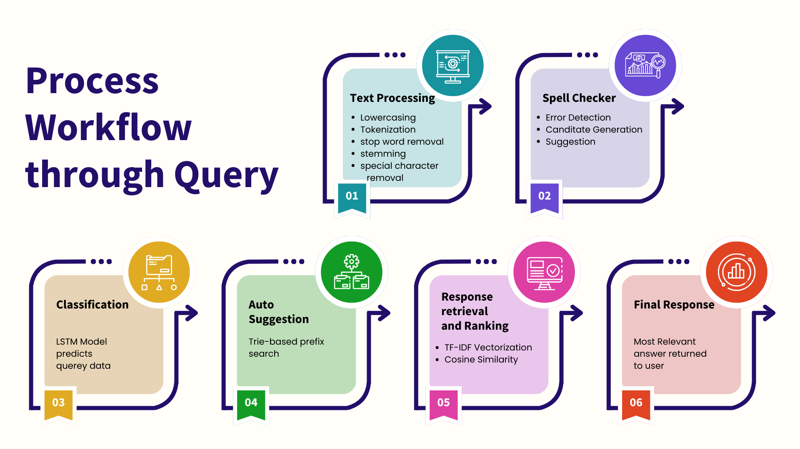
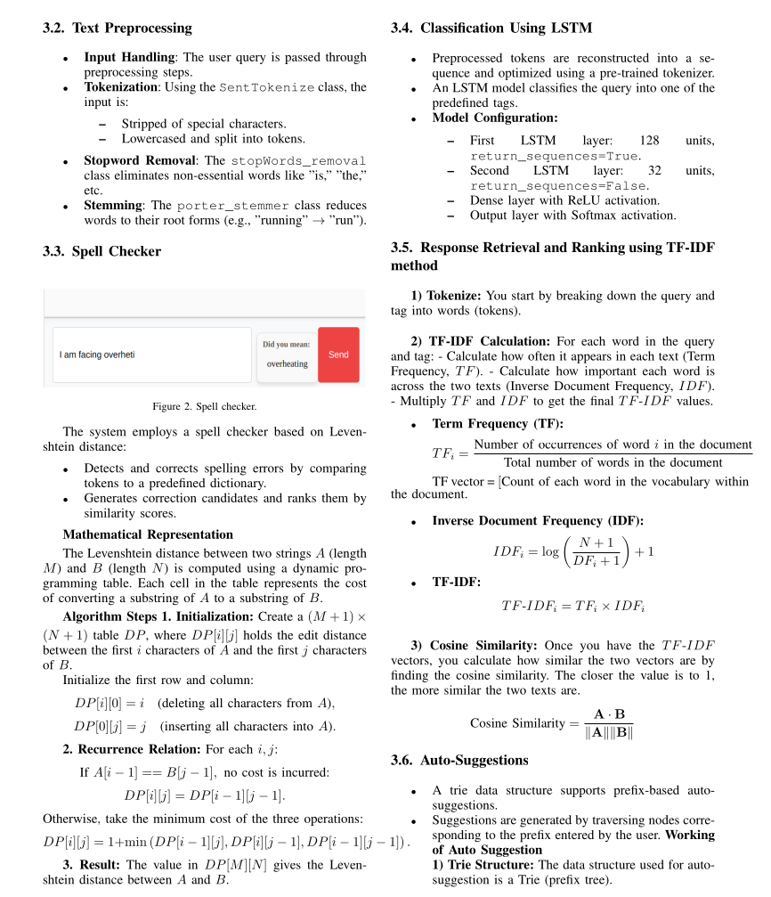
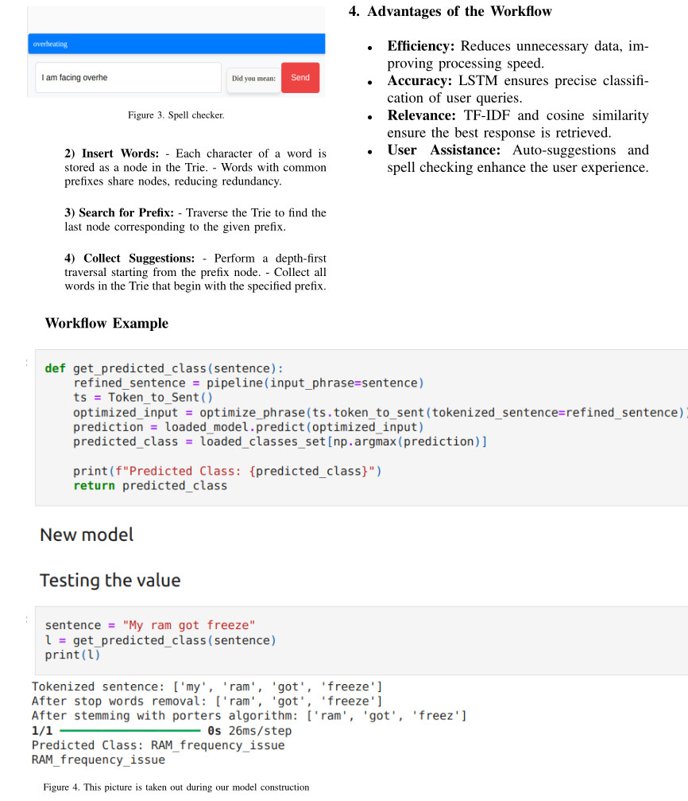
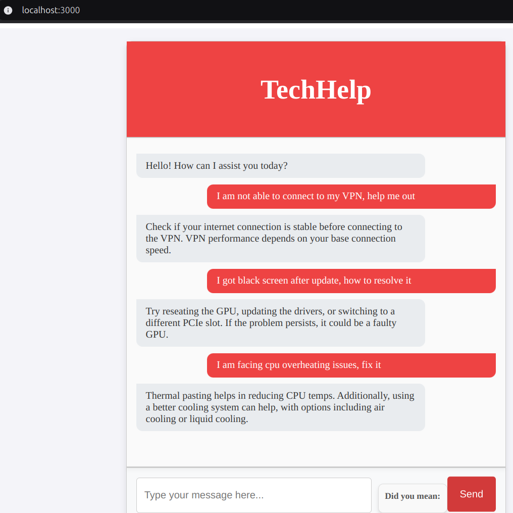

## Start the project by creating a virtual environment with command "python/python3 -m venv vir", then activate it. 

--> Starting front-end part
    * navigate to "cd ChatBot" 
    * Download the nodemodules with the command "npm install" 
    * Then start the project by entering "npm start" 
    * You can see a chatbot loaded on your browser, don't use it unless you run the backend part of it. 

--> Starting the backend server
    * navigate to "cd backend". 
    * Install the required packages using the command "pip/pip3 install -r requirements.txt". (Preferred to install in inside a virtual environmet, to overcome the bugs of overriding) 
    * Start the server with command "python/python3 test.py".

Use our techbot after setting up the front-end and backend running successfully.b

### Project inforamtion

### Methodology

I started started off with collecting dataset manually from websites like, "stack overflow", "linus tech tips" and "microsoft support". It's stored in "corpus" folder with structure ,

""""" 
{
      "tag": "wifi_troubleshooting",
      "patterns": [
        "Why can't I connect to Wi-Fi?",
        "How do I fix Wi-Fi connection issues?",
        "My Wi-Fi is not working",
        "Why is my Wi-Fi connection unstable?",
        "How do I reconnect to Wi-Fi after losing connection?"
      ],
      "response": [
        "Make sure Wi-Fi is turned on. Go to Settings > Network & Internet > Wi-Fi, then ensure it's enabled. Restart your modem and router if needed.",
        "Try restarting your router and device. If that doesn't work, update the network adapter driver through Device Manager.",
        "Run the Network Troubleshooter by going to Start > Settings > Network & Internet > Status, and select Network Troubleshooter."
      ],
      "source": "Microsoft Support (https://support.microsoft.com/en-us/help/10741/windows-fix-network-connection-issues)"
    },
"""""  

## Steps of our work :- 

### 1. **Query Lifecycle**

 

### 2. **Text Processing**
 

### 3. **WorkFlow**
 

### 4. **Working**
 

### 5. **Train-Test Split**:
- The padded sequences are split into two sets: **training data** (80%) and **validation data** (20%). This ensures that the model can be evaluated on unseen data while training.

### 6. **Model Architecture**:
- The architecture consists of:
  - **Embedding Layer**: The words are mapped into dense vectors of fixed size (in this case, each word is represented as a vector of size 10).
  - **LSTM Layers**: Two Long Short-Term Memory (LSTM) layers are added to the model. These layers are used to process sequential data and capture relationships between words.
    - The first LSTM layer outputs the entire sequence of hidden states.
    - The second LSTM layer outputs only the final hidden state.
  - **Dropout Layers**: Dropout layers help to prevent overfitting by randomly dropping some neurons during training.
  - **Dense Layers**: Two dense (fully connected) layers are used to process the output from the LSTM and classify the input into one of the intents.
  - **Softmax Activation**: The final layer uses a softmax activation function to predict the probability of each intent class.

### 7. **Model Compilation**:
- The model is compiled using the **Adam optimizer** with a learning rate of `0.001`. The loss function used is **sparse categorical cross-entropy**, suitable for multi-class classification problems.
- The model tracks accuracy as a metric during training.

### 8. **Model Training**:
- The model is trained for 200 epochs using a batch size of 4. During each epoch, the model learns from the training data and evaluates its performance on the validation data after each epoch.

### 9. **Model Evaluation**:
- After training, the model is evaluated on the validation set to compute **validation loss** and **validation accuracy**.
- These metrics indicate how well the model performs on unseen data (validation data) after the training process.

### 10. **Model and Tokenizer Saving**:
- Once the model is trained, it is saved as a file (`my_model.keras`) for later use.
- The **Tokenizer** and **LabelEncoder** objects are also saved as `.pkl` files. These are required during inference to preprocess new input data (converting text into sequences).
- The maximum length of input sequences (`max_len`) is stored in a separate file (`model_metadata.json`), which is useful for padding future inputs correctly.
